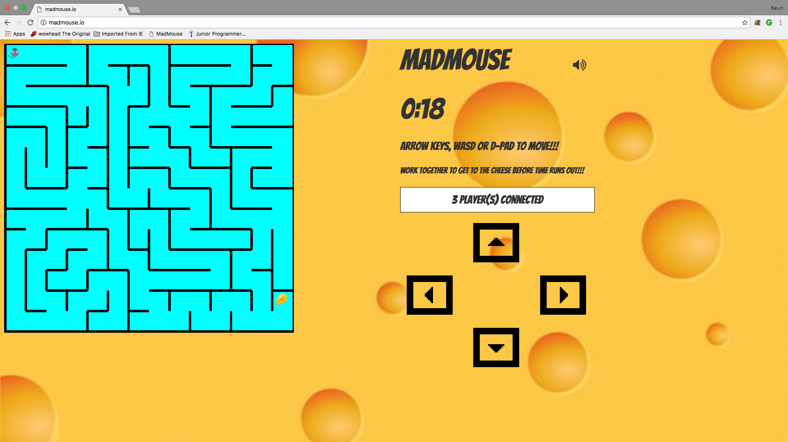
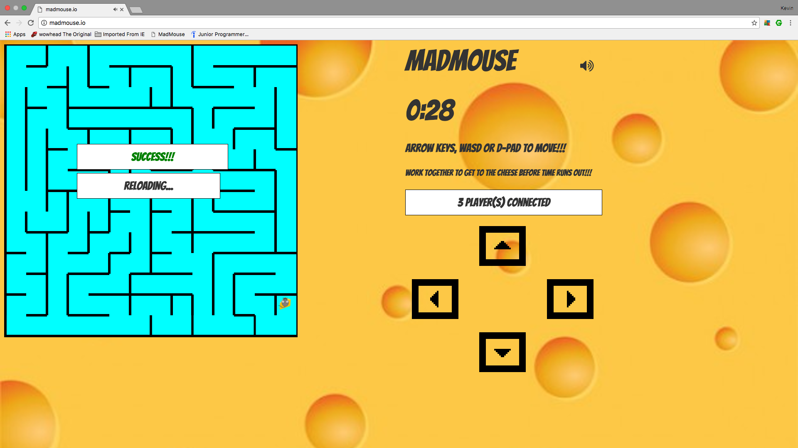

## Madmouse.io

#### URL:  (http://madmouse.io)

#### Overview:
Madmouse.io is a browser-based multiplayer video game I built in which players guide a single mouse through a maze to get to the cheese. It's built with JavaScript, node.js, AngularJS 1, Socket.IO, and more!

##### Technologies:
HTML/CSS
JavaScript
node.js
AngularJS 1
JQuery
Socket.IO
Express

##### Example Code:

Maze 1's Two-Dimensional Array of Cell Objects:

```

[             // Row A
              [{up: true, right: false, down: false, left: true, name: 'A1'}, {up: true, right: true, down: true, left: false, name: 'A2'}, {up: true, right: false, down: false, left: true, name: 'A3'}, {up: true, right: true, down: false, left: false, name: 'A4'}, {up: true, right: false, down: false, left: true, name: 'A5'}, {up: true, right: false, down: true, left: false, name: 'A6'}, {up: true, right: false, down: true, left: false, name: 'A7'}, {up: true, right: false, down: true, left: false, name: 'A8'}, {up: true, right: true, down: false, left: false, name: 'A9'}, {up: true, right: false, down: false, left: true, name: 'A10'}, {up: true, right: false, down: true, left: false, name: 'A11'}, {up: true, right: false, down: true, left: false, name: 'A12'}, {up: true, right: false, down: true, left: false, name: 'A13'}, {up: true, right: true, down: true, left: false, name: 'A14'}],
              // Row B
              [{up: false, right: false, down: false, left: true, name: 'B1'}, {up: true, right: false, down: false, left: false, name: 'B2'}, {up: false, right: true, down: true, left: false, name: 'B3'}, {up: false, right: true, down: false, left: true, name: 'B4'}, {up: false, right: false, down: true, left: true, name: 'B5'}, {up: true, right: true, down: false, left: false, name: 'B6'}, {up: true, right: false, down: false, left: true, name: 'B7'}, {up: true, right: true, down: false, left: false, name: 'B8'}, {up: false, right: true, down: false, left: true, name: 'B9'}, {up: false, right: false, down: true, left: true, name: 'B10'}, {up: true, right: false, down: true, left: false, name: 'B11'}, {up: true, right: true, down: false, left: false, name: 'B12'}, {up: true, right: false, down: false, left: true, name: 'B13'}, {up: true, right: true, down: false, left: false, name: 'B14'}],
              // Row C
              [{up: false, right: true, down: false, left: true, name: 'C1'}, {up: false, right: false, down: true, left: true, name: 'C2'}, {up: true, right: true, down: false, left: false, name: 'C3'}, {up: false, right: false, down: true, left: true, name: 'C4'}, {up: true, right: false, down: true, left: false, name: 'C5'}, {up: false, right: false, down: true, left: false, name: 'C6'}, {up: false, right: true, down: true, left: false, name: 'C7'}, {up: false, right: true, down: true, left: true, name: 'C8'}, {up: false, right: false, down: true, left: true, name: 'C9'}, {up: true, right: false, down: false, left: false, name: 'C10'}, {up: true, right: false, down: true, left: false, name: 'C11'}, {up: false, right: false, down: true, left: false, name: 'C12'}, {up: false, right: true, down: false, left: false, name: 'C13'}, {up: false, right: true, down: false, left: true, name: 'C14'}],
              // Row D
              [{up: false, right: true, down: false, left: true, name: 'D1'}, {up: true, right: false, down: false, left: true, name: 'D2'}, {up: false, right: true, down: false, left: false, name: 'D3'}, {up: true, right: false, down: true, left: true, name: 'D4'}, {up: true, right: false, down: true, left: false, name: 'D5'}, {up: true, right: false, down: true, left: false, name: 'D6'}, {up: true, right: false, down: true, left: false, name: 'D7'}, {up: true, right: false, down: true, left: false, name: 'D8'}, {up: true, right: true, down: false, left: false, name: 'D9'}, {up: false, right: true, down: false, left: true, name: 'D10'}, {up: true, right: false, down: false, left: true, name: 'D11'}, {up: true, right: false, down: true, left: false, name: 'D12'}, {up: false, right: true, down: true, left: false, name: 'D13'}, {up: false, right: true, down: false, left: true, name: 'D14'}],
              // Row E
              [{up: false, right: true, down: false, left: true, name: 'E1'}, {up: false, right: true, down: false, left: true, name: 'E2'}, {up: false, right: false, down: true, left: true, name: 'E3'}, {up: true, right: true, down: false, left: false, name: 'E4'}, {up: true, right: false, down: false, left: true, name: 'E5'}, {up: true, right: true, down: false, left: false, name: 'E6'}, {up: true, right: false, down: false, left: true, name: 'E7'}, {up: true, right: true, down: false, left: false, name: 'E8'}, {up: false, right: true, down: false, left: true, name: 'E9'}, {up: false, right: false, down: false, left: true, name: 'E10'}, {up: false, right: true, down: false, left: false, name: 'E11'}, {up: true, right: false, down: false, left: true, name: 'E12'}, {up: true, right: true, down: false, left: false, name: 'E13'}, {up: false, right: true, down: true, left: true, name: 'E14'}],
              // Row F
              [{up: false, right: true, down: false, left: true, name: 'F1'}, {up: false, right: true, down: false, left: true, name: 'F2'}, {up: true, right: false, down: false, left: true, name: 'F3'}, {up: false, right: false, down: true, left: false, name: 'F4'}, {up: false, right: true, down: true, left: false, name: 'F5'}, {up: false, right: true, down: false, left: true, name: 'F6'}, {up: false, right: true, down: false, left: true, name: 'F7'}, {up: false, right: false, down: true, left: true, name: 'F8'}, {up: false, right: true, down: true, left: false, name: 'F9'}, {up: false, right: true, down: false, left: true, name: 'F10'}, {up: false, right: false, down: true, left: true, name: 'F11'}, {up: false, right: true, down: true, left: false, name: 'F12'}, {up: false, right: false, down: true, left: true, name: 'F13'}, {up: true, right: true, down: false, left: false, name: 'F14'}],
              // Row G
              [{up: false, right: true, down: false, left: true, name: 'G1'}, {up: false, right: true, down: false, left: true, name: 'G2'}, {up: false, right: false, down: true, left: true, name: 'G3'}, {up: true, right: false, down: true, left: false, name: 'G4'}, {up: true, right: true, down: true, left: false, name: 'G5'}, {up: false, right: true, down: false, left: true, name: 'G6'}, {up: false, right: false, down: false, left: true, name: 'G7'}, {up: true, right: false, down: true, left: false, name: 'G8'}, {up: true, right: false, down: true, left: false, name: 'G9'}, {up: false, right: false, down: false, left: false, name: 'G10'}, {up: true, right: false, down: true, left: false, name: 'G11'}, {up: true, right: false, down: true, left: false, name: 'G12'}, {up: true, right: true, down: false, left: false, name: 'G13'}, {up: false, right: true, down: false, left: true, name: 'G14'}],
              // Row H
              [{up: false, right: false, down: false, left: true, name: 'H1'}, {up: false, right: true, down: false, left: false, name: 'H2'}, {up: true, right: true, down: false, left: true, name: 'H3'}, {up: true, right: false, down: false, left: true, name: 'H4'}, {up: true, right: true, down: false, left: false, name: 'H5'}, {up: false, right: false, down: true, left: true, name: 'H6'}, {up: false, right: true, down: false, left: false, name: 'H7'}, {up: true, right: false, down: true, left: true, name: 'H8'}, {up: true, right: true, down: false, left: false, name: 'H9'}, {up: false, right: true, down: false, left: true, name: 'H10'}, {up: true, right: false, down: true, left: true, name: 'H11'}, {up: true, right: false, down: true, left: false, name: 'H12'}, {up: false, right: true, down: true, left: false, name: 'H13'}, {up: false, right: true, down: false, left: true, name: 'H14'}],
              // Row I
              [{up: false, right: true, down: false, left: true, name: 'I1'}, {up: false, right: false, down: true, left: true, name: 'I2'}, {up: false, right: true, down: true, left: false, name: 'I3'}, {up: false, right: true, down: false, left: true, name: 'I4'}, {up: false, right: true, down: true, left: true, name: 'I5'}, {up: true, right: false, down: false, left: true, name: 'I6'}, {up: false, right: true, down: false, left: false, name: 'I7'}, {up: true, right: false, down: false, left: true, name: 'I8'}, {up: false, right: true, down: true, left: false, name: 'I9'}, {up: false, right: false, down: true, left: true, name: 'I10'}, {up: true, right: false, down: true, left: false, name: 'I11'}, {up: true, right: false, down: true, left: false, name: 'I12'}, {up: true, right: true, down: false, left: false, name: 'I13'}, {up: false, right: true, down: false, left: true, name: 'I14'}],
              // Row J
              [{up: false, right: false, down: true, left: true, name: 'J1'}, {up: true, right: true, down: false, left: false, name: 'J2'}, {up: true, right: false, down: false, left: true, name: 'J3'}, {up: false, right: true, down: true, left: false, name: 'J4'}, {up: true, right: false, down: false, left: true, name: 'J5'}, {up: false, right: true, down: true, left: false, name: 'J6'}, {up: false, right: true, down: false, left: true, name: 'J7'}, {up: false, right: false, down: true, left: true, name: 'J8'}, {up: true, right: true, down: false, left: false, name: 'J9'}, {up: true, right: false, down: false, left: true, name: 'J10'}, {up: true, right: false, down: true, left: false, name: 'J11'}, {up: true, right: false, down: true, left: false, name: 'J12'}, {up: false, right: true, down: true, left: false, name: 'J13'}, {up: false, right: true, down: true, left: true, name: 'J14'}],
              // Row K
              [{up: true, right: false, down: false, left: true, name: 'K1'}, {up: false, right: true, down: true, left: false, name: 'K2'}, {up: false, right: false, down: false, left: true, name: 'K3'}, {up: true, right: false, down: true, left: false, name: 'K4'}, {up: false, right: true, down: true, left: false, name: 'K5'}, {up: true, right: false, down: false, left: true, name: 'K6'}, {up: false, right: true, down: true, left: false, name: 'K7'}, {up: true, right: false, down: true, left: true, name: 'K8'}, {up: false, right: false, down: true, left: false, name: 'K9'}, {up: false, right: true, down: false, left: false, name: 'K10'}, {up: true, right: false, down: false, left: true, name: 'K11'}, {up: true, right: false, down: true, left: false, name: 'K12'}, {up: true, right: false, down: true, left: false, name: 'K13'}, {up: true, right: true, down: false, left: false, name: 'K14'}],
              // Row L
              [{up: false, right: false, down: true, left: true, name: 'L1'}, {up: true, right: true, down: false, left: false, name: 'L2'}, {up: false, right: true, down: false, left: true, name: 'L3'}, {up: true, right: false, down: false, left: true, name: 'L4'}, {up: true, right: false, down: true, left: false, name: 'L5'}, {up: false, right: true, down: true, left: false, name: 'L6'}, {up: true, right: false, down: true, left: true, name: 'L7'}, {up: true, right: false, down: true, left: false, name: 'L8'}, {up: true, right: false, down: true, left: false, name: 'L9'}, {up: false, right: true, down: false, left: false, name: 'L10'}, {up: false, right: true, down: false, left: true, name: 'L11'}, {up: true, right: false, down: false, left: true, name: 'L12'}, {up: true, right: false, down: true, left: false, name: 'L13'}, {up: false, right: true, down: true, left: false, name: 'L14'}],
              // Row M
              [{up: true, right: false, down: false, left: true, name: 'M1'}, {up: false, right: true, down: true, left: false, name: 'M2'}, {up: false, right: true, down: false, left: true, name: 'M3'}, {up: false, right: false, down: true, left: true, name: 'M4'}, {up: true, right: false, down: true, left: false, name: 'M5'}, {up: true, right: true, down: false, left: false, name: 'M6'}, {up: true, right: false, down: false, left: true, name: 'M7'}, {up: true, right: true, down: false, left: false, name: 'M8'}, {up: true, right: true, down: false, left: true, name: 'M9'}, {up: false, right: true, down: false, left: true, name: 'M10'}, {up: false, right: true, down: false, left: true, name: 'M11'}, {up: false, right: false, down: true, left: true, name: 'M12'}, {up: true, right: true, down: false, left: false, name: 'M13'}, {up: true, right: true, down: false, left: true, name: 'M14'}],
              // Row N
              [{up: false, right: false, down: true, left: true, name: 'N1'}, {up: true, right: false, down: true, left: false, name: 'N2'}, {up: false, right: false, down: true, left: false, name: 'N3'}, {up: true, right: false, down: true, left: false, name: 'N4'}, {up: true, right: false, down: true, left: false, name: 'N5'}, {up: false, right: false, down: true, left: false, name: 'N6'}, {up: false, right: true, down: true, left: false, name: 'N7'}, {up: false, right: false, down: true, left: true, name: 'N8'}, {up: false, right: true, down: true, left: false, name: 'N9'}, {up: false, right: false, down: true, left: true, name: 'N10'}, {up: false, right: false, down: true, left: false, name: 'N11'}, {up: true, right: true, down: true, left: false, name: 'N12'}, {up: false, right: false, down: true, left: true, name: 'N13'}, {up: false, right: true, down: true, left: false, name: 'N14'}]
];

```
User Input Example:

```

socket.on('keypress', function(data) {
  // what happens when a user pushes up arrow or 'W' key
  if (data[0] === 'top') {
    if (data[1] === 'up' && maze[coordY][coordX].up === false) {
      y -= 50;
      coordY += data[3];
      coordX += data[4];
      src = 'images/mouse_up.png';

      // win event check:
      if (coordX === 13 && coordY === 12) {
        isCounting = false;
        io.emit('winEvent');
        setTimeout(function(){
          coordX = 0;
          coordY = 0;
          x = 20;
          y = 20;

          // clock is reset here:
          realTime = 120;
          seconds = 60;
          stop = false;
          minutesPassed = 0;
          minutes = 1;
          isCounting = true;
          maze = whichMaze();
          start = new Date().getTime();
          io.emit('newGame', maze);
        }, 5000);
      }
    }

```

Screen shot:



